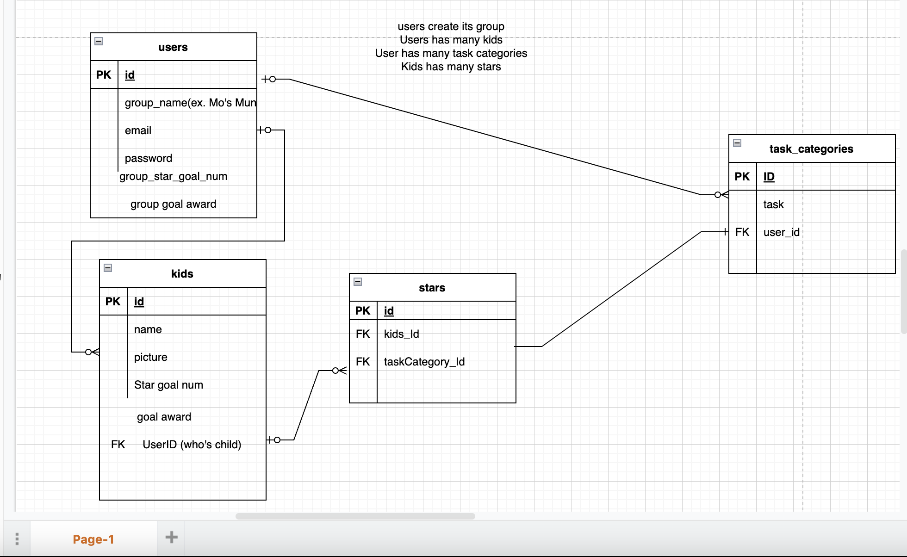
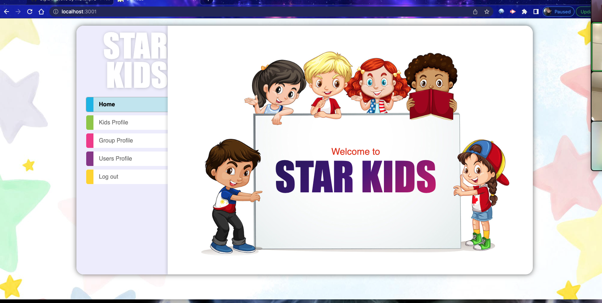
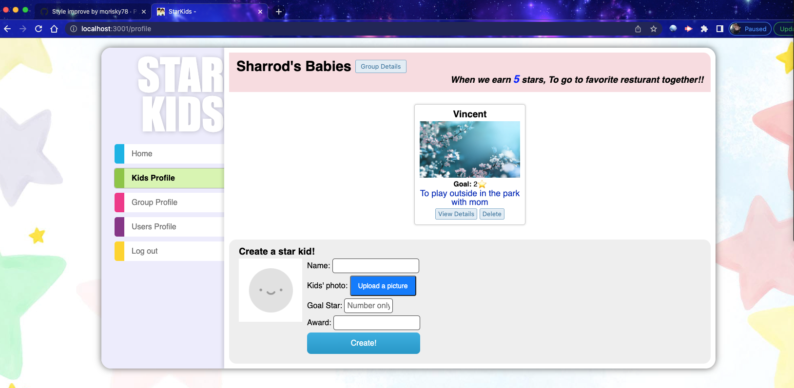
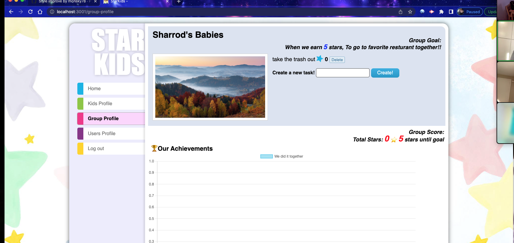
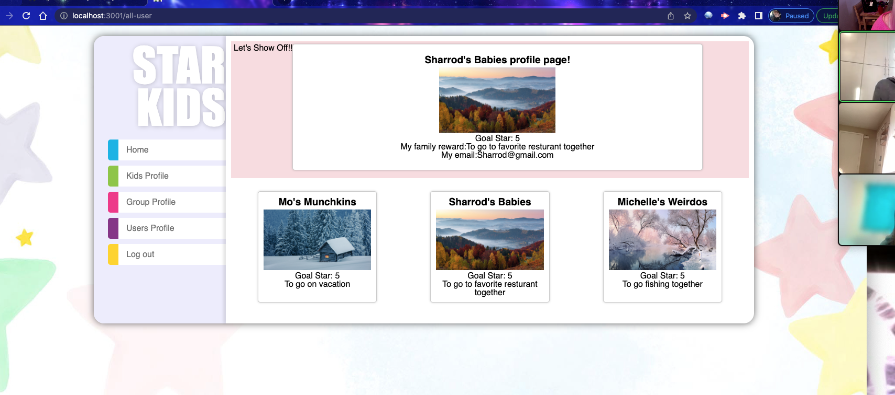
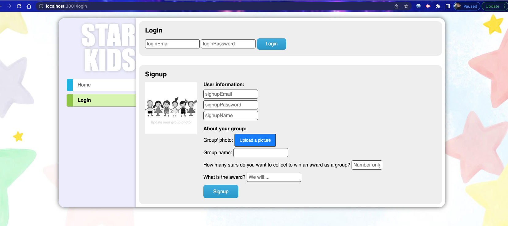

    
    
    
    
    
    
    

# Star Kids
Hello and welcome to Star Kids - where parents win and kids score!

## Table of Contents
- [General Information](#general-information)
- [Installation](#installation)
- [Usage](#usage)
- [Example](#example)
- [Team Collaborations](#collaborations)
- [Questions](#questions)

## General Information
As a parent user, you set up tasks and their corresponding points for each of your child. You can also set up rewards and their corresponding points. 
A child can earn points by doing tasks, and with enough points they can choose the reward they want.

## Installation
First the user needs to install npm packages, which should come with sequelize, mysql, and cloudinary. The user needs to make sure to use mysql to get the db set and run the seeds.

## Usage
The user must make sure to run mysql to get the db and tables. Once this is done the user needs to run the seeds and get the server up and listening. From here the user can create or login to an account. After you have logged in you may add children, tasks, and stars to their profile page.User has the ability to add or remove children, tasks, and once a task is completed then add a star!

## Example

github- https://github.com/swnova/starKids.git
heroku- https://starkids-app.herokuapp.com/

## Credits & Collaborations

  Shreya Mishra, Mo Risk, Michelle Beaudoin and Sharrod Willinova contributed equally and created the entirety of this Website. 
  Mo- She was our frontend guru, she used her amazing skills to make the client side of our project amazing and pleasing to the eye! While also adding the handlebars to make it functioning.
  Shreya- She worked with backend stuff, building the data base structure, user handlebar and made the models all connect and run smoothly. She used her creativity to get each page to function properly.

  Sharrod- He built the repo and set up the initial folders and files for the group to put code into, and was the github manager.

  Michelle- She was our project maganger, she built the controllers and tested them to make sure they were working properly. She made sure the konbon board was up to date and helped anyone that needed assistance in pushing or pulling without hiccups.
 
 You can find other projects by Shreya, Mo, Sharrod and Michelle at each of their github pages: [Mo Risk](https://github.com/morisky78), [Shreya](https://github.com/shreyamishra9618), [Sarrod](https://github.com/swnova) and 
 [Michelle](https://github.com/mfarrell23).